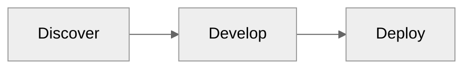

# D3London

We are a 'cloud lab' made up of collaborators from different organisations, based out of the London AI Centre. Our data engineers, data scientists, ML engineers, and domain experts work across different national technology and data science programmes, including the London Secure Data Environment programme.

